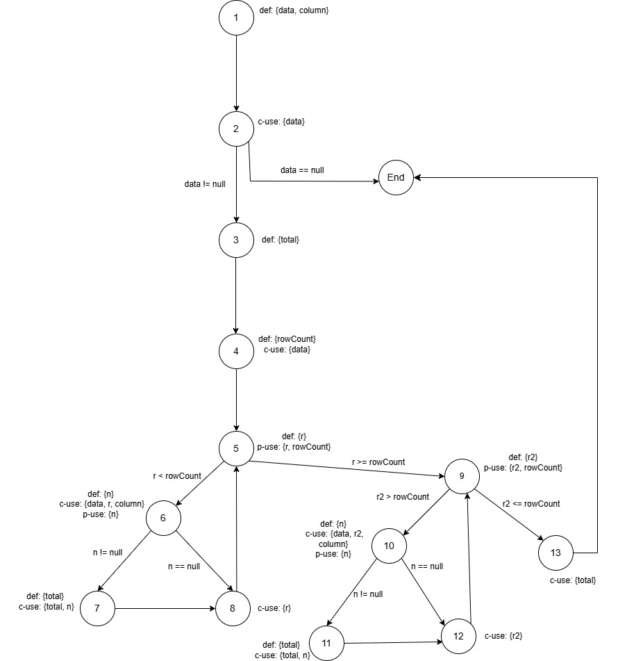

**SENG 438 - Software Testing, Reliability, and Quality**

**Lab. Report #3 – Code Coverage, Adequacy Criteria and Test Case Correlation**

| Group \#: 16   |     |
| -------------- | --- |
| Student Names: | Sahib Singh Thethi |
|                | Sukriti Badhwar |
|                | Wade Banman |
|                | Rohan Lange |

(Note that some labs require individual reports while others require one report
for each group. Please see each lab document for details.)

# 1 Introduction

With a focus on code coverage as a gauge of test suite adequacy, our team's third assignment aimed to improve our comprehension and use of white-box testing methodologies. Using control-flow and data-flow coverage criteria, this assignment changed our methodology from requirements-based test generation to coverage-based test generation, building on the unit testing abilities we acquired in Assignment 2. As our System Under Test (SUT), we used the open-source Java charting package JFreeChart framework, focusing on the org.jfree.data.DataUtilities and org.jfree.data.Range classes. EclEmma, which was incorporated into Eclipse, served as our main instrument for evaluating control-flow coverage. It enabled us to evaluate the statement, branch, and method coverage of our test suite. Through this process, we improved our comprehension of the relationship between coverage metrics and test effectiveness while investigating the usefulness, drawbacks, and practical implementation of coverage tools. This report highlights our team's efforts to enhance the JFreeChart test suite and assess the trade-offs between various testing methodologies. It also describes our approach, results, and views on the process.

# 2 Manual data-flow coverage calculations for X and Y methods

## **DataUtilities Class - calculateColumnTotal()**

**Def-Use Sets:**

|  **Node** |    **Def**   |       **Use**       |
|-----------|--------------|---------------------|
|   1       | data, column |          -          |
|   2       |       -      |         data        |
|   3       |     total    |          -          |
|   4       |   rowCount   |         data        |
|   5       |       r      |     r, rowCount     |
|   6       |       n      |  data, r, column, n |
|   7       |     total    |       total, n      |
|   8       |       -      |          r          |
|   9       |      r2      |     r2, rowCount    |
|  10       |       n      | data, r2, column, n |
|  11       |     total    |       total, n      |
|  12       |       -      |          r2         |
|  13       |       -      |        total        |

**DU-pairs:**

| **Variable** |                                 **DU Pair**                                |
|----------|------------------------------------------------------------------------|
| data     | (1,2), (1,4), (1,6), (1,10)                                            |
| column   | (1, 6), (1,10)                                                         |
| total    | (3, 7), (7, 11), (11, 13), (3, 11), (7, 13), (3, 13), (7, 7), (11, 11) |
| rowCount | (4, 5), (4, 9)                                                         |
| r        | (5, 5), (5, 6), (5, 8)                                                 |
| r2       | (9, 9), (9, 10), (9, 12)                                               |
| n        | (6, 6), (6, 7), (10, 10), (10, 11)                                     |

**Test Cases Coverage:**

|                   Test Cases                   |                                                                                            Pairs Covered                                                                                            |
|:----------------------------------------------:|:---------------------------------------------------------------------------------------------------------------------------------------------------------------------------------------------------:|
| calculateColumnTotalForMultipleRows()          | (1, 2), (1, 4), (1, 6), (1, 10), (1, 6), (1, 10), (3, 7), (7, 11), (11, 13), (7, 7), (11, 11), (4, 5), (4, 9), (5, 5), (5, 6), (5, 8), (9, 9), (9, 10), (9, 12), (6, 6), (6, 7), (10, 10), (10, 11) |
| calculateColumnTotalForSingleRowSingleColumn() | (1, 2), (1, 4), (1, 6), (1, 10), (1, 6), (1, 10), (3, 7), (7, 11), (11, 13), (7, 7), (11, 11), (4, 5), (4, 9), (5, 5), (5, 6), (5, 8), (9, 9), (9, 10), (9, 12), (6, 6), (6, 7), (10, 10), (10, 11) |
| calculateColumnTotalForNegativeValues()        | (1, 2), (1, 4), (1, 6), (1, 10), (1, 6), (1, 10), (3, 7), (7, 11), (11, 13), (7, 7), (11, 11), (4, 5), (4, 9), (5, 5), (5, 6), (5, 8), (9, 9), (9, 10), (9, 12), (6, 6), (6, 7), (10, 10), (10, 11) |
| calculateColumnTotalForNullValue()             | (1, 2), (1, 4), (1, 6), (1, 10), (1, 6), (1, 10), (3, 7), (7, 11), (11, 13), (7, 7), (11, 11), (4, 5), (4, 9), (5, 5), (5, 6), (5, 8), (9, 9), (9, 10), (9, 12), (6, 6), (6, 7), (10, 10), (10, 11) |
| calculateColumnTotalForEmptyTable()            | (1, 2), (1, 4), (3, 13), (4, 5), (4, 9), (5, 5), (9, 9)                                                                                                                                             |
| calculateColumnTotalForNullData()              | (1, 2)                                                                                                                                                                                              |
| calculateColumnTotalForColumnOutOfBounds()     | (1, 2), (1, 4), (3, 13), (4, 5), (4, 9), (5, 5), (9, 9)                                                                                                                                             |
| calculateColumnTotalForNegativeColumnIndex()   | (1, 2), (1, 4), (3, 13), (4, 5), (4, 9), (5, 5), (9, 9)                                                                                                                                             |

DU pair coverage = (Covered DU-pairs) / (Total DU-pairs) = (24 / 26) x 100 = 92.31%

# 3 A detailed description of the testing strategy for the new unit test

Text…

# 4 A high level description of five selected test cases you have designed using coverage information, and how they have increased code coverage

1. **`testGetCumulativePercentagesWithNullValues()`** for `getCumulativePercentages()`:

This test case is designed to verify the behavior of the getCumulativePercentages() method when the input data contains null values. The purpose of this test is to ensure that the method correctly handles missing values without affecting the overall calculation of cumulative percentages.

Impact on Code Coverage:
Branch Coverage: Increased from 58.3% to 75% by testing paths involving null values.
Statement Coverage: Maintained at 83.3%, confirming execution of all relevant lines of code.
Method Coverage: Remains at 100%, ensuring the method is fully tested.

This test case strengthens the robustness of the getCumulativePercentages() method by verifying its handling of missing data, ensuring correctness under real-world conditions.

# 5 A detailed report of the coverage achieved of each class and method (a screen shot from the code cover results in green and red color would suffice)

Text…

# 6 Pros and Cons of coverage tools used and Metrics you report

In our assignment, we used EclEmma as our code coverage tool. It was selected because of its smooth Eclipse integration, which makes it simple to use and set up. Although EclEmma did not offer condition coverage, it did enable us to measure statement, branch, and method coverage. Its visual feedback technique, which displayed uncovered code in red and covered code in green, was one of its most helpful features. Because of this, it was simpler to find areas where our test coverage was lacking and adjust our unit tests appropriately. We were also able to keep the majority of our initial tests while performing white-box testing to increase coverage because EclEmma was compatible with mock objects.

However, EclEmma had some limitations. One major drawback was that it did not support condition coverage, which would have allowed us to analyze individual Boolean subconditions within decision statements. Additionally, the tool did not account for dead or unreachable code, which affected our overall coverage percentage. For example, in the DataUtilities class, our statement coverage was 89.6% instead of reaching 90% because EclEmma still considered logically unreachable code in its calculations.

In terms of reported metrics, we primarily focused on statement coverage (percentage of executed statements), branch coverage (percentage of executed control flow branches), and method coverage (percentage of methods executed at least once). These metrics helped us assess test effectiveness and guided improvements in our testing approach. Despite its limitations, EclEmma was a valuable tool for evaluating and improving our test coverage.

# 7 A comparison on the advantages and disadvantages of requirements-based test generation and coverage-based test generation.

Text…

# 8 A discussion on how the team work/effort was divided and managed

Text…

# 9 Any difficulties encountered, challenges overcome, and lessons learned from performing the lab

Our team faced a some difficulties during this assignment that put our technical proficiency and collaboration to the test. Integrating EclEmma with our Eclipse setup and making sure it functioned flawlessly with our current test suite from Assignment 2 was a major challenge. At first, we had problems when building the system's packages, which led to problems when utilizing EclEmma. In order to get around this, we looked at compatibility problems for a while before deciding to re-run the Eclipse setup and make sure that every step is done correctly while installing the right libraries and building new packages. We learned from this how crucial it is to check tool compatibility early on and modify our strategy as necessary. Calculating data-flow coverage by hand for the DataUtilities.calculateColumnTotal function presented another difficulty. Because calculateColumnTotal()'s control flow is so intricate, manually tracking DU-pairs was laborious and prone to mistakes. In order to solve this, we divided the assignment into manageable chunks, which increased precision and strengthened our comprehension of data-flow principles. This experience made clear how time-consuming human analysis is and how beneficial automated tools are for larger systems. The limiting of coverage metrics as the only measure of test quality was one of the most important lessons learnt.  Although reaching the desired coverage was a clear objective, we discovered that high coverage was not always effective in identifying flaws, particularly in edge cases that were hidden by inaccessible code.

# 10 Comments/feedback on the lab itself

Building successfully on the groundwork established in Assignment 2, Assignment 3 offered a priceless chance to expand our knowledge of white-box testing and code coverage.  The work was both difficult and gratifying because of the practical viewpoint that the manual computation of data-flow coverage and the hands-on experience with tools like EclEmma provided.  Our efforts were guided by the assignment's well-defined framework, which included tool familiarization, coverage measurement, and test suite development. Overall, the assignment was well-designed to meet its learning objectives, fostering both technical proficiency and critical thinking.
